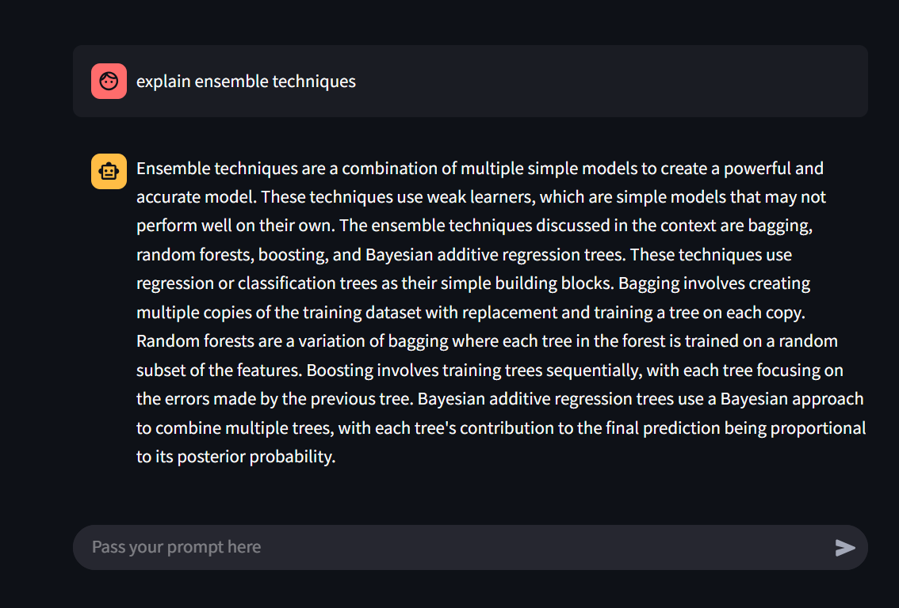

# ML_Chatbot
A chatbot that explains machine learning concepts and terminologies using HuggingFace,Langchain, FAISS and Streamlit.It provides fast and relavent response using Mistral AI inference for embeddings and FAISS-CPU for efficient similarity search.

## Features
Understands ML concepts - Answers ML-related questions and explain key terms.
Efficient Retrieval - Uses FAISS for fast and optimized search.
Mistral AI Embeddings - Ensures accurate results with powerful embeddings.
User-Friendly Interface - Built with streamlit for an interactive experiance.

## Tech Tools

* LangChain – Handles LLM interactions.
* Hugging Face – Provides embeddings via Mistral AI inference.
* FAISS – Optimized vector search for retrieval.
* Streamlit – Simple front-end for easy interaction.

## Installation

1. Clone the repository  
- git clone https://github.com/yourusername/ML_Chatbot.git  
- cd ML_Chatbot

2. Install Dependencies  
- pip install -r requirements.txt

3. Run the chatbot  
- streamlit run app.py

## How It Works
1. The chatbot takes user queries related to ML.
2. It converts the text into embeddings using Mistral AI (via Hugging Face).
3. FAISS searches for the most relevant response.
4. The chatbot displays the best match in a clean Streamlit UI.

## Future Improvements
* Improve retrieval with better embeddings.
* Add more ML-related content.
* Fine-tune responses for better accuracy.